# Agent Panel 系统详细设计文档

> 版本：v1.0
> 状态：设计稿（可实施）
> 技术栈：前端 umi max + antd6 + Ant Design Pro Components；后端 Spring Boot 4 + Spring AI 2.0；数据库 PostgreSQL；对象存储 S3/MinIO；编排 Docker / Kubernetes

---

## 目录

1. [项目概述](#1-项目概述)
2. [总体架构](#2-总体架构)
3. [技术选型与版本](#3-技术选型与版本)
4. [工程结构](#4-工程结构)
5. [数据模型设计](#5-数据模型设计)
6. [认证与权限（RBAC）](#6-认证与权限rbac)
7. [运行时抽象层（容器编排）](#7-运行时抽象层容器编排)
8. [应用中心](#8-应用中心)
9. [监控与日志](#9-监控与日志)
10. [文件与对象存储](#10-文件与对象存储)
11. [Spring AI 模型网关](#11-spring-ai-模型网关)
12. [Agent 协同方案（多智能体编排）](#12-agent-协同方案多智能体编排)
13. [API 设计总览](#13-api-设计总览)
14. [安全设计](#14-安全设计)
15. [部署方案](#15-部署方案)
16. [实施路线图](#16-实施路线图)
17. [附录](#17-附录)

---

## 1. 项目概述

### 1.1 背景与目标

Agent Panel 是一个面向自托管 AI Agent 的统一管理面板。它把 OpenClaw、Hermes Agent、openclaude 等以 Docker 镜像形态发布的 Agent 框架，纳入一个可视化平台进行**托管部署、配置、运行与监控**，并提供统一的用户权限、文件存储、模型网关能力。

核心价值：

- **零运维托管**：在面板上"新建应用"即可拉起对应 Agent 容器，无需手工写 compose / kubectl。
- **统一治理**：统一的用户权限、密钥管理、模型接入、文件存储、审计。
- **可移植部署**：面板自身前后端打包为单镜像，可部署到 Docker 单机或 Kubernetes 集群。
- **可协同**：为未来多个 Agent 之间的协同（网关路由、子智能体委派、共享推理/记忆）预留架构。

### 1.2 被托管的 Agent 形态

三类 Agent 均为标准容器镜像，通过环境变量配置、卷持久化数据、暴露端口对外服务，平台据此抽象出统一的"应用模板"。

- **OpenClaw**：网关型多通道编排器（Node.js）。镜像 `ghcr.io/openclaw/openclaw`，数据目录 `/home/node/.openclaw`，端口 `18789`（示例）。支持 Ollama、多平台通道。
- **Hermes Agent**：自我进化型推理 Agent（Python，Nous Research）。镜像 `ghcr.io/nousresearch/hermes-agent`，数据目录 `/opt/data`（或 `~/.hermes`），网关端口（如 `3000`）+ 面板端口（如 `9119`）。OpenAI 兼容端点；支持多种 terminal backend。
- **openclaude**：Claude 系列 Agent 运行时（占位，按上游镜像实际参数适配）。

> 三者均支持 MCP（Model Context Protocol），OpenClaw 与 Hermes 协议兼容，可"OpenClaw 作网关 + Hermes 作后端推理"组合运行 —— 这是第 12 章协同方案的基础。

### 1.3 系统功能清单

| 模块 | 功能 |
| --- | --- |
| 用户与权限 | 登录登出、用户管理、角色管理、菜单/权限管理、RBAC 鉴权、审计日志 |
| 应用中心 | 应用模板、应用 CRUD、env 配置、端口/资源/卷配置、部署/启停/重启/删除、运行状态 |
| 监控面板 | CPU/内存/网络实时图表、容器健康状态、事件 |
| 日志管理 | 容器日志流式查看、检索、下载 |
| 文件管理 | 对象存储（S3/MinIO）浏览/上传/下载、容器卷文件管理 |
| 模型网关 | 多模型 Provider 管理、密钥加密、对话调试 Playground、向 Agent 注入统一端点 |
| 协同编排 | （前瞻）Agent 拓扑、网关路由、共享推理、子智能体委派 |
| 部署运维 | 单镜像、docker-compose、k8s 清单 |

---

## 2. 总体架构

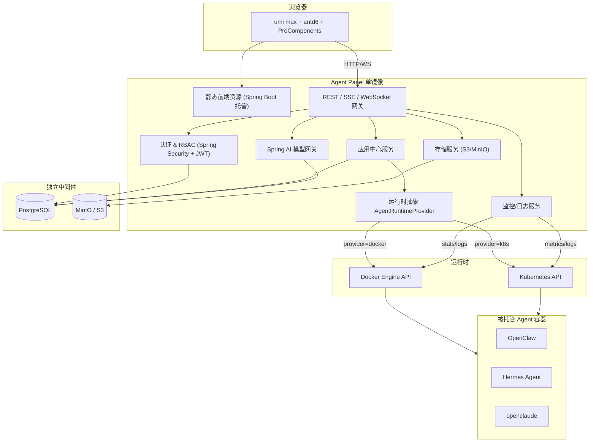

### 2.1 关键设计原则

- **前后端一体单镜像**：前端构建产物嵌入后端，Spring Boot 同时托管静态资源与 API，简化部署。
- **运行时可插拔**：通过 `AgentRuntimeProvider` 抽象屏蔽 Docker/K8s 差异，配置切换。
- **配置即数据**：应用的 env/端口/资源/卷以结构化数据（JSONB）存库，部署时组装成 `DeploySpec`。
- **密钥不落明文**：API Key 等敏感配置加密存储，K8s 下投影为 Secret。

---

## 3. 技术选型与版本

### 3.1 前端

- **umi max**：内置 layout、access（权限）、request、model、initialState 等插件。
- **antd 6** + **@ant-design/pro-components**：ProLayout / ProTable / ProForm / ProDescriptions。
- **图表**：`@ant-design/charts`（监控面板）。
- **实时**：原生 `EventSource`（SSE 日志/指标）与 `WebSocket`（终端/双向）。
- 包管理：pnpm。

### 3.2 后端

- **Spring Boot 4**（Java 21）。
- **Spring Security 6** + JWT（`io.jsonwebtoken:jjwt`）。
- **Spring Data JPA** + **Flyway**（数据库迁移）。
- **Spring AI 2.0**：模型网关、对话调试。
- **docker-java**：Docker provider。
- **fabric8 kubernetes-client**：K8s provider。
- **AWS SDK v2 (S3)**：S3/MinIO 统一访问。
- **MapStruct**（DTO 映射）、**springdoc-openapi**（接口文档）。
- 加密：Jasypt 或自定义 AES-GCM（密钥管理见 14 章）。

### 3.3 数据与中间件

- **PostgreSQL 16**（预留 `pgvector` 扩展供未来向量检索）。
- **MinIO**（S3 兼容，开发/私有部署）或任意 S3。

---

## 4. 工程结构

monorepo，前后端 + 部署清单同库。

```
agent-panel/
├── frontend/                       # umi max 前端
│   ├── src/
│   │   ├── app.tsx                 # 运行时配置: 布局 / initialState(当前用户+权限)
│   │   ├── access.ts               # RBAC 权限点定义
│   │   ├── services/               # API 封装 (按模块)
│   │   ├── pages/
│   │   │   ├── login/
│   │   │   ├── dashboard/
│   │   │   ├── system/{user,role,menu}/
│   │   │   ├── app/{list,detail}/  # detail 内含 概览/环境变量/监控/日志/文件 Tab
│   │   │   ├── files/
│   │   │   └── ai/{models,playground}/
│   │   ├── components/
│   │   └── constants/
│   ├── config/                     # umi config + 路由
│   └── package.json
│
├── backend/                        # Spring Boot 单应用
│   ├── src/main/java/com/agentpanel/
│   │   ├── AgentPanelApplication.java
│   │   ├── common/                 # 通用: 响应包装/异常/分页/加密/工具
│   │   ├── config/                 # 安全/跨域/Jackson/OpenAPI/线程池
│   │   ├── auth/                   # 登录/JWT/当前用户
│   │   ├── system/                 # 用户/角色/菜单/权限/审计
│   │   ├── application/            # 应用中心: template / application / deployment
│   │   ├── runtime/                # 运行时抽象 + docker/k8s 实现
│   │   │   ├── api/                # AgentRuntimeProvider, DeploySpec, RuntimeStatus...
│   │   │   ├── docker/             # DockerRuntimeProvider
│   │   │   └── k8s/                # K8sRuntimeProvider
│   │   ├── monitor/                # stats/logs 采集与推送
│   │   ├── storage/                # S3/MinIO 存储服务
│   │   └── ai/                     # Spring AI 模型网关
│   ├── src/main/resources/
│   │   ├── application.yml
│   │   ├── db/migration/           # Flyway: V1__init.sql ...
│   │   └── static/                 # 构建期注入前端产物
│   └── pom.xml
│
├── deploy/
│   ├── Dockerfile                  # 多阶段: 前端构建 -> 后端构建 -> 运行
│   ├── docker-compose.yml          # panel + postgres + minio
│   └── k8s/                        # Deployment/Service/Ingress/ConfigMap/Secret/RBAC/PG/MinIO
│
├── docs/
│   └── Agent-Panel-设计文档.md
└── README.md
```

---

## 5. 数据模型设计

### 5.1 ER 概览

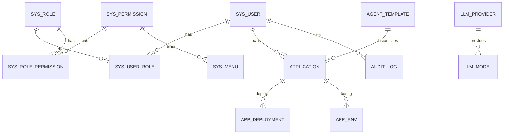

### 5.2 表清单与字段（PostgreSQL）

> 通用字段：所有表含 `id BIGINT/UUID 主键`、`created_at`、`updated_at`、`created_by`、`updated_by`、`deleted`(软删)。下表仅列业务字段。

#### 权限域

- **sys_user**：`username`(唯一)、`password`(BCrypt)、`nickname`、`email`、`phone`、`avatar`、`status`(enabled/disabled)、`last_login_at`。
- **sys_role**：`code`(唯一)、`name`、`description`、`status`。
- **sys_permission**：`code`(唯一, 如 `app:deploy`)、`name`、`type`(menu/button/api)、`parent_id`。
- **sys_menu**：`name`、`path`、`icon`、`component`、`parent_id`、`order_no`、`permission_id`、`hidden`。
- **sys_user_role**：`user_id`、`role_id`。
- **sys_role_permission**：`role_id`、`permission_id`。
- **audit_log**：`user_id`、`action`、`resource_type`、`resource_id`、`detail`(JSONB)、`ip`、`result`、`at`。

#### 应用域

- **agent_template**：
  - `code`(唯一, openclaw/hermes/openclaude)、`name`、`description`、`icon`
  - `image`(默认镜像)、`default_tag`
  - `port_schema`(JSONB，端口定义：name/containerPort/protocol/expose)
  - `env_schema`(JSONB，env 定义：key/label/required/secret/default/description)
  - `volume_schema`(JSONB，卷定义：name/containerPath/required/description)
  - `default_resources`(JSONB，cpu/mem 限制)
  - `builtin`(bool)、`doc_url`
- **application**：
  - `name`(唯一)、`template_id`、`owner_id`
  - `image`、`tag`（可覆盖模板）
  - `status`(created/deploying/running/stopped/error)
  - `ports`(JSONB 实际端口映射)、`resources`(JSONB)、`volumes`(JSONB)
  - `replicas`(K8s 用)、`runtime_provider`(docker/k8s，缺省取全局)
  - `remark`
- **app_env**：`application_id`、`key`、`value`(加密，若 secret)、`is_secret`(bool)。
  （也可整体存 `application.env` JSONB；secret 项单独加密。文档采用独立表便于审计与权限控制。）
- **app_deployment**（部署记录/快照）：
  - `application_id`、`provider`(docker/k8s)
  - `ref`(容器ID / Deployment 名)、`namespace`(k8s)
  - `image_used`、`status`、`message`
  - `started_at`、`stopped_at`、`spec_snapshot`(JSONB 部署当时的完整 DeploySpec)

#### 模型域

- **llm_provider**：`code`、`name`、`type`(openai/ollama/azure/anthropic/custom)、`base_url`、`api_key`(加密)、`enabled`、`config`(JSONB)。
- **llm_model**：`provider_id`、`model`(模型名)、`label`、`capabilities`(JSONB: chat/embedding/vision)、`enabled`。

#### 系统配置

- **sys_setting**：`key`、`value`(JSONB)、`description`（存储 S3 配置、全局 runtime provider 等可热更新项；敏感值加密）。

### 5.3 状态机（应用）

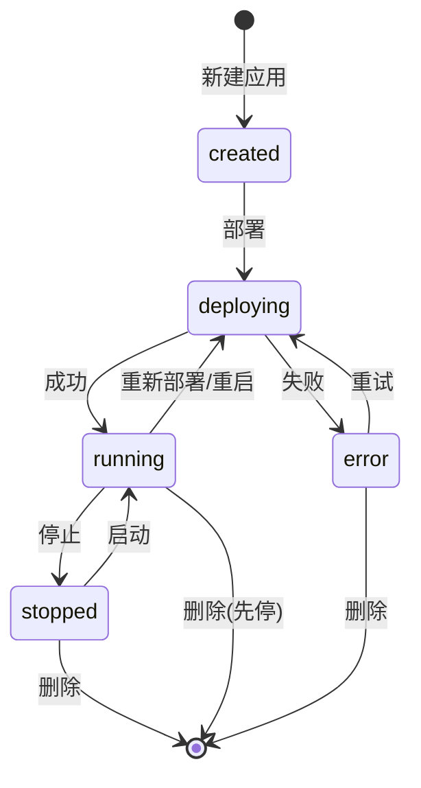

---

## 6. 认证与权限（RBAC）

### 6.1 认证流程

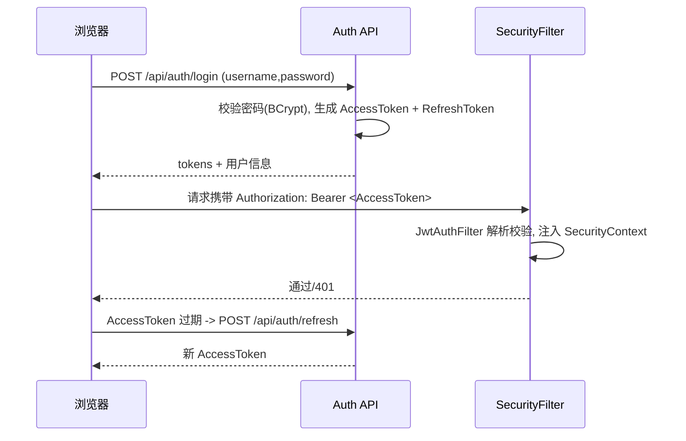

- **AccessToken**：短期（如 30 分钟），无状态 JWT，载荷含 `userId/username/roles`。
- **RefreshToken**：长期（如 7 天），存 DB/Redis（本期存 DB 表 `sys_refresh_token` 或内存，生产建议 Redis），支持吊销。
- 密码：BCrypt。登录失败次数限制（可选）。

### 6.2 鉴权模型

- 后端：方法级 `@PreAuthorize("hasAuthority('app:deploy')")`，权限点来自用户角色聚合的 `sys_permission.code`。
- 前端：
  - `app.tsx` 的 `getInitialState` 拉取 `/api/auth/current`（用户 + 权限码 + 菜单树）。
  - `access.ts` 把权限码映射为可用于路由 `access` 字段与 `<Access>` 组件、按钮显隐的布尔。
  - 动态菜单：由后端菜单树驱动 ProLayout。

### 6.3 内置角色

- `SUPER_ADMIN`：全部权限。
- `ADMIN`：用户/应用/模型/文件管理（不含系统级危险操作）。
- `OPERATOR`：仅应用部署与运维（启停/查看监控日志）。
- `VIEWER`：只读。

---

## 7. 运行时抽象层（容器编排）

### 7.1 设计目标

用一套接口同时支持 Docker（单机/单容器场景）与 Kubernetes（集群场景），上层应用中心无需感知差异。通过配置 `agent.runtime.provider=docker|k8s` 或 `application.runtime_provider` 字段（应用级覆盖）选择实现。

### 7.2 接口定义

```java
public interface AgentRuntimeProvider {
    String type();                          // "docker" | "k8s"

    DeployResult deploy(DeploySpec spec);   // 创建并启动
    void start(RuntimeRef ref);
    void stop(RuntimeRef ref);
    void restart(RuntimeRef ref);
    void remove(RuntimeRef ref);

    RuntimeStatus status(RuntimeRef ref);   // phase + 健康
    ResourceStats stats(RuntimeRef ref);    // 瞬时 cpu/mem/net
    Flux<LogLine> logs(RuntimeRef ref, LogOptions opt);   // 流式日志(follow)
}
```

关键模型：

```java
record DeploySpec(
    String name, String image, String tag,
    Map<String,String> env,                 // 已解密的有效 env
    List<PortMapping> ports,                 // 容器端口 + 主机/Service 端口
    List<VolumeMount> volumes,               // 卷/PVC
    ResourceLimits resources,                // cpu/mem
    int replicas,                            // k8s
    Map<String,String> labels
) {}

record RuntimeRef(String provider, String ref, String namespace) {}
record RuntimeStatus(Phase phase, boolean healthy, String message) {} // CREATED/RUNNING/STOPPED/ERROR
record ResourceStats(double cpuPercent, long memUsedBytes, long memLimitBytes, long netRxBytes, long netTxBytes) {}
```

### 7.3 Docker 实现要点（docker-java）

- 连接：`DOCKER_HOST`（默认 `unix:///var/run/docker.sock`）。
- deploy：`createContainerCmd(image)` 设置 env、`PortBinding`、`Bind`(volume)、`HostConfig`(cpu/mem/restartPolicy)、labels（标记 `agentpanel.app=<id>`）→ `startContainerCmd`。
- stats：`statsCmd` 单次采样计算 CPU%。
- logs：`logContainerCmd().withFollowStream(true)` → 转 `Flux<LogLine>`。
- 卷：bind mount 到宿主机目录 `${data.root}/apps/<appId>/<volumeName>`。

### 7.4 Kubernetes 实现要点（fabric8）

- deploy：创建 `Deployment`（env/资源/卷/replicas）+ `Service`（端口）+ 可选 `Ingress`；secret 投影为 `Secret`，卷用 `PVC`。命名空间隔离（如 `agentpanel-apps`）。
- status：读 Deployment/Pod 状态。
- stats：metrics-server（`metrics.k8s.io`）或 Pod 资源。
- logs：`pods().withName().watchLog()` 流式。
- 权限：面板 Pod 绑定 ServiceAccount + Role/RoleBinding（见 15 章）。

### 7.5 选择策略

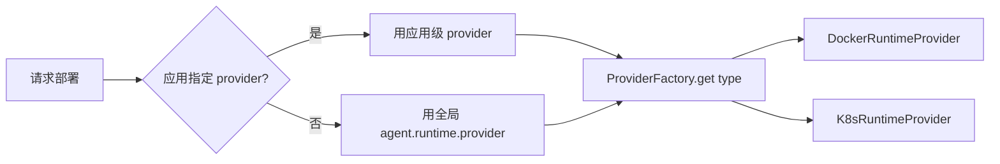

---

## 8. 应用中心

### 8.1 新建并部署流程

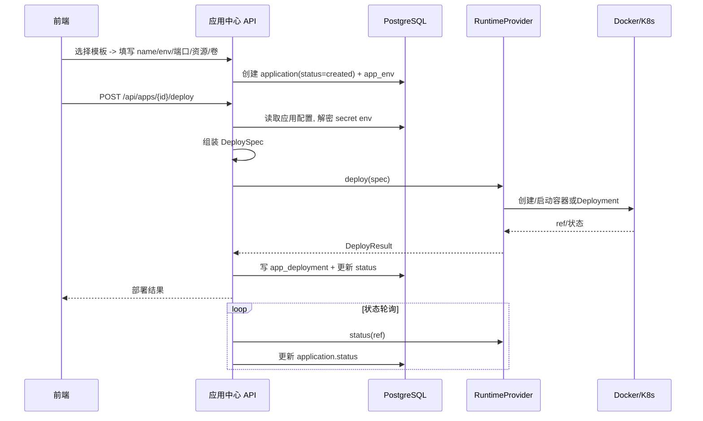

### 8.2 模板机制

模板定义了"这类 Agent 需要哪些 env / 端口 / 卷"，前端据 `env_schema` 动态渲染表单（required/secret/default），降低配置门槛。内置三套模板（OpenClaw/Hermes/openclaude），通过 Flyway 初始化数据写入 `agent_template`。

OpenClaw 模板示例（节选）：

```json
{
  "code": "openclaw",
  "image": "ghcr.io/openclaw/openclaw",
  "default_tag": "latest",
  "port_schema": [{"name":"gateway","containerPort":18789,"protocol":"TCP","expose":true}],
  "env_schema": [
    {"key":"OPENROUTER_API_KEY","label":"OpenRouter API Key","required":false,"secret":true},
    {"key":"OLLAMA_BASE_URL","label":"Ollama 地址","required":false,"secret":false}
  ],
  "volume_schema": [{"name":"data","containerPath":"/home/node/.openclaw","required":true}]
}
```

### 8.3 应用详情页（前端 Tab）

- **概览**：状态、镜像、端口、访问地址、资源、操作按钮（部署/启停/重启/删除）。
- **环境变量**：env 列表编辑（secret 项掩码显示），保存后需重新部署生效。
- **监控**：CPU/内存/网络实时图表（见第 9 章）。
- **日志**：流式日志、检索、下载。
- **文件**：容器卷文件浏览 + 对象存储（见第 10 章）。

### 8.4 操作与权限映射

| 操作 | 接口 | 权限码 |
| --- | --- | --- |
| 查看应用 | GET /api/apps | app:read |
| 新建/编辑 | POST/PUT /api/apps | app:write |
| 部署 | POST /api/apps/{id}/deploy | app:deploy |
| 启停/重启 | POST /api/apps/{id}/{start\|stop\|restart} | app:operate |
| 删除 | DELETE /api/apps/{id} | app:delete |
| 查看日志/监控 | GET .../logs, .../stats | app:read |

---

## 9. 监控与日志

### 9.1 指标采集与推送

- 后端定时（如 5s）从 RuntimeProvider 拉取每个运行中应用的 `ResourceStats`，通过 **SSE** (`/api/apps/{id}/stats/stream`) 推送给前端图表；前端用 `@ant-design/charts` 渲染滚动曲线。
- 健康/状态变化写入 `application.status` 与事件流。

### 9.2 日志流

- `/api/apps/{id}/logs/stream`（SSE）：`logs(ref, follow=true)` 转发；支持 `since`、`tail`、关键字过滤参数。
- 日志下载：`/api/apps/{id}/logs/download`（一次性拉取 N 行打包）。

### 9.3 数据流图

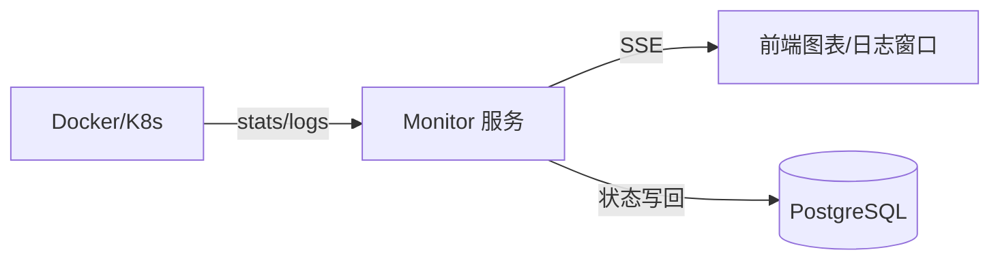

> 进阶（可选，非首期）：接入 Prometheus + cAdvisor/metrics-server，Grafana 看板嵌入；本设计首期采用应用内直采 + SSE，避免额外依赖。

---

## 10. 文件与对象存储

### 10.1 统一存储抽象

```java
public interface StorageService {
    void putObject(String bucket, String key, InputStream in, long size, String contentType);
    InputStream getObject(String bucket, String key);
    URL presignedGetUrl(String bucket, String key, Duration ttl);
    URL presignedPutUrl(String bucket, String key, Duration ttl);
    List<ObjectInfo> list(String bucket, String prefix);
    void delete(String bucket, String key);
}
```

- 实现：AWS SDK v2 `S3Client`，`endpointOverride` 指向 MinIO 或 S3；`pathStyleAccess` 适配 MinIO。
- 配置：`sys_setting` 或 `application.yml`（endpoint / region / accessKey / secretKey 加密 / bucket）。

### 10.2 两类文件管理

1. **对象存储文件**：平台级文件库（用户上传的素材、备份等），走 `StorageService` + 预签名 URL（前端直传/直下，减轻后端压力）。
2. **容器卷文件**：某应用的数据卷内文件管理。
   - Docker：卷对应宿主机目录，后端直接读写（受限于面板进程可访问该目录）。
   - K8s：通过 `kubectl cp` 等价 API（`PodOperationsImpl#file`）或在 Pod 内置 sidecar/exec 读写。
   - 统一暴露：`GET/POST /api/apps/{id}/files`（list/upload/download/delete）。

### 10.3 上传流程（对象存储，前端直传）

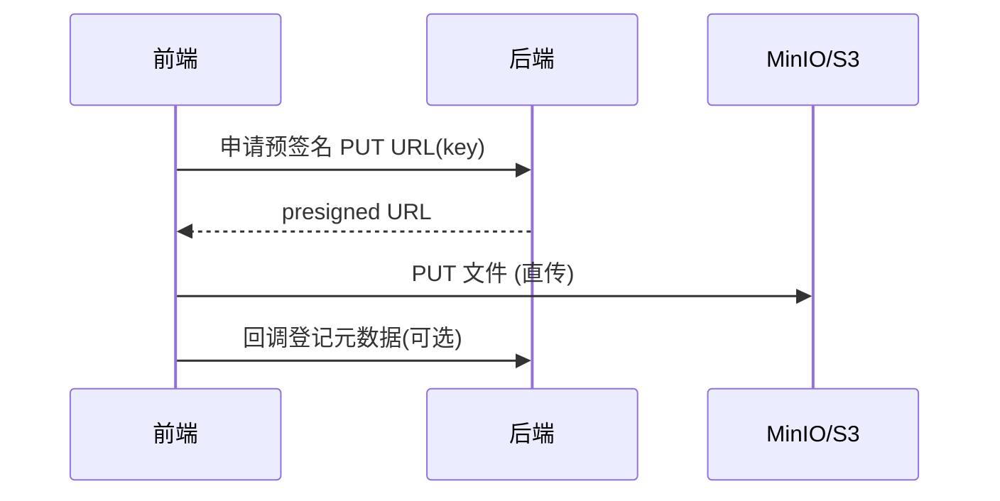

---

## 11. Spring AI 模型网关

### 11.1 定位

平台既是 Agent 管理面板，也充当**统一模型网关**：集中管理多家模型 Provider 与密钥，提供对话调试 Playground，并可把"统一端点 + Key"作为 env 注入到 Agent（让 OpenClaw/Hermes 指向平台网关而非各自直连厂商）。

### 11.2 能力

- **Provider 管理**：增删改查 `llm_provider`（OpenAI 兼容 / Ollama / Azure / Anthropic / 自定义），密钥加密存储。
- **模型管理**：每个 Provider 下注册可用 `llm_model`（chat/embedding/vision 能力标注）。
- **对话调试 Playground**：`POST /api/ai/chat`（SSE 流式），基于 Spring AI `ChatClient` 动态选择模型，便于验证模型连通性与效果。
- **统一推理端点（可选）**：平台暴露 OpenAI 兼容 `/v1/chat/completions` 代理，按 Provider 路由 —— 作为第 12 章"共享推理"的落地点。

### 11.3 与 Spring AI 集成

- 运行期按 `llm_provider.type` 动态构建对应 `ChatModel`/`ChatClient`（OpenAI 兼容用 base_url + api_key）。
- 统一封装请求/响应、流式（`Flux<ChatResponse>` → SSE）、错误与重试。

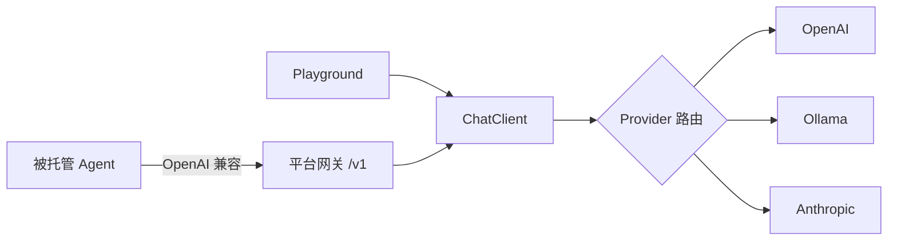

---

## 12. Agent 协同方案（多智能体编排）

> 这是面向未来的前瞻设计：让平台托管的多个 Agent 之间互相协同，而不仅是各自独立运行。OpenClaw 定位"网关/编排器"，Hermes/openclaude 定位"推理/执行后端"，三者通过 MCP 协议与共享推理/记忆互通。

### 12.1 协同模式

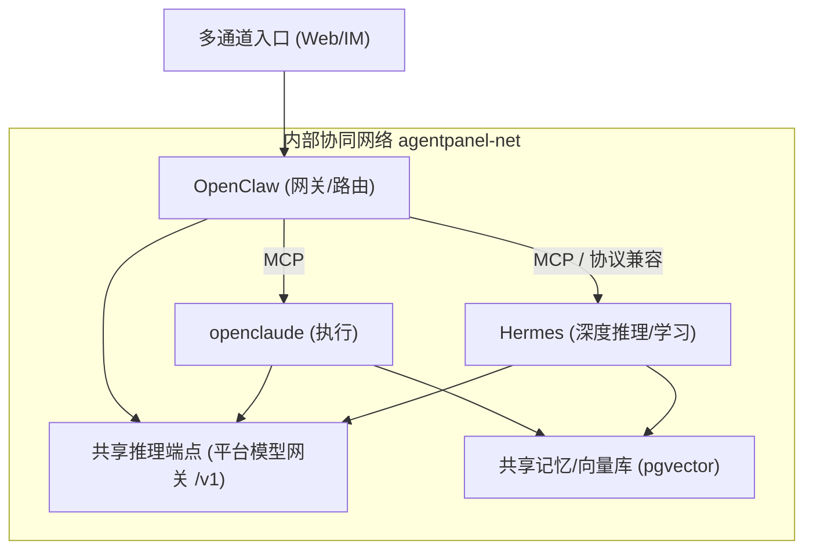

四种典型协同：

1. **网关路由（Gateway Routing）**：OpenClaw 作统一入口，按任务类型把请求路由到 Hermes（深度推理）或 openclaude（执行类）。
2. **子智能体委派（Sub-agent Delegation）**：主 Agent 将子任务并行委派给其他 Agent，聚合结果（Hermes 原生支持 delegates/parallel subagents）。
3. **共享推理（Shared Inference）**：所有 Agent 的 LLM 调用统一指向平台模型网关 `/v1`，集中计费、限流、可观测、密钥治理。
4. **共享记忆（Shared Memory）**：约定统一的记忆/技能存储（pgvector + 对象存储），跨 Agent 复用上下文与技能文档。

### 12.2 平台侧需要提供的能力（分阶段）

- **协同网络**：部署时把同一"协同组"的 Agent 接入同一内部网络（Docker network / K8s 同 namespace + Service DNS），使其可用服务名互访。
- **拓扑编排对象**：新增 `agent_topology`（组）与 `agent_topology_node`（成员 + 角色 gateway/worker + 互联关系），可视化编排画布（前端拖拽连线）。
- **MCP 注册中心**：登记各 Agent 暴露的 MCP server 与工具，供其它 Agent 发现调用。
- **统一推理网关**：第 11.2 的 `/v1` 代理作为共享推理落点。
- **共享记忆服务**：基于 `pgvector` 的向量检索 API + 对象存储的技能/文件共享。

### 12.3 数据模型扩展（协同，未来）

- **agent_topology**：`name`、`description`、`network`(内部网络名/namespace)、`status`。
- **agent_topology_node**：`topology_id`、`application_id`、`role`(gateway/worker)、`config`(JSONB，路由规则/MCP 暴露)。
- **agent_link**：`topology_id`、`from_node_id`、`to_node_id`、`protocol`(mcp/http)、`config`。
- **mcp_endpoint**：`application_id`、`url`、`tools`(JSONB)、`enabled`。

### 12.4 演进路线（协同部分）

- 阶段 A：同网络互访 + 共享推理网关（最小协同）。
- 阶段 B：拓扑编排画布 + MCP 注册发现。
- 阶段 C：共享记忆/向量库 + 子智能体委派可视化追踪。

> 说明：协同方案在本期作为"架构预留 + 数据模型预留"，不纳入首期编码，但首期的网络/网关/存储设计需保证可平滑扩展（如部署时即支持指定网络、模型网关即支持 `/v1` 代理）。

---

## 13. API 设计总览

统一响应包装：`{ code, message, data, traceId }`；分页：`{ list, total, page, pageSize }`；错误码规范化。

### 13.1 认证

- `POST /api/auth/login` / `POST /api/auth/logout`
- `POST /api/auth/refresh`
- `GET  /api/auth/current`（当前用户 + 权限码 + 菜单树）

### 13.2 系统管理

- `GET/POST/PUT/DELETE /api/users`，`PUT /api/users/{id}/roles`，`PUT /api/users/{id}/password`
- `GET/POST/PUT/DELETE /api/roles`，`PUT /api/roles/{id}/permissions`
- `GET/POST/PUT/DELETE /api/menus`，`GET/POST/PUT/DELETE /api/permissions`
- `GET /api/audit-logs`

### 13.3 应用中心

- `GET /api/templates`
- `GET/POST/PUT/DELETE /api/apps`
- `GET/PUT /api/apps/{id}/env`
- `POST /api/apps/{id}/deploy|start|stop|restart`
- `GET /api/apps/{id}/status`
- `GET /api/apps/{id}/stats/stream`（SSE）
- `GET /api/apps/{id}/logs/stream`（SSE）、`GET /api/apps/{id}/logs/download`
- `GET/POST/DELETE /api/apps/{id}/files`

### 13.4 文件/存储

- `GET /api/files?prefix=`、`POST /api/files/presign`、`DELETE /api/files`

### 13.5 模型网关

- `GET/POST/PUT/DELETE /api/ai/providers`、`GET/POST/PUT/DELETE /api/ai/models`
- `POST /api/ai/chat`（SSE）
- `POST /v1/chat/completions`（OpenAI 兼容代理，供 Agent 共享推理，可选）

---

## 14. 安全设计

- **认证**：JWT（AccessToken 短期 + RefreshToken 可吊销）；密码 BCrypt。
- **鉴权**：方法级 `@PreAuthorize`，前端 access 双重校验（前端仅 UI 体验，后端为准）。
- **密钥加密**：API Key / 存储密钥用 AES-GCM 加密落库，主密钥来自环境变量 `APP_SECRET_KEY`（K8s Secret 注入），不入库不入仓。
- **容器编排权限**：
  - Docker：挂载 docker.sock 等同宿主机 root，**仅限可信单机**；限制面板暴露面，开启鉴权与审计。
  - K8s：ServiceAccount 仅授予所需命名空间的最小 RBAC（Deployment/Service/Pod/Log/PVC）。
- **网络**：被托管 Agent 的管理端口（如 Hermes dashboard）默认不对公网暴露，经反代/Ingress + 鉴权访问。
- **审计**：关键操作（部署/启停/删除/改密钥）写 `audit_log`。
- **传输**：生产强制 HTTPS（反代/Ingress TLS）。
- **多租户隔离（可选）**：应用 owner 维度的数据隔离与配额。

---

## 15. 部署方案

### 15.1 单镜像（前后端一体）

多阶段构建：前端 build → 拷贝到后端 `static` → 后端打 jar → 运行期 JRE 镜像。

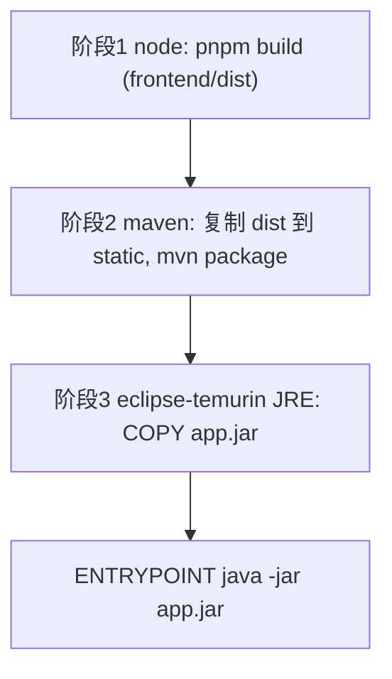

Dockerfile 关键步骤：
1. `node:20` 构建前端 → `frontend/dist`。
2. `maven:3.9-eclipse-temurin-21` 把 `dist` 拷到 `backend/src/main/resources/static`，`mvn -DskipTests package`。
3. `eclipse-temurin:21-jre` 运行 jar。

### 15.2 Docker Compose（单机，provider=docker）

`deploy/docker-compose.yml` 服务：
- `panel`：单镜像；挂载 `/var/run/docker.sock`；环境变量 `AGENT_RUNTIME_PROVIDER=docker`、DB/MinIO/SECRET 配置；数据卷 `${data.root}`。
- `postgres`：PostgreSQL 16，持久卷。
- `minio`：MinIO，持久卷，暴露 9000/9001。
- 自定义网络 `agentpanel-net`（同时作为被托管 Agent 的协同网络）。

### 15.3 Kubernetes（集群，provider=k8s）

`deploy/k8s/`：
- `namespace.yaml`：`agentpanel`、`agentpanel-apps`。
- `serviceaccount.yaml` + `rbac.yaml`：面板 SA 在 `agentpanel-apps` 的最小权限（deployments/services/pods/pods-log/pvc/secrets/configmaps）。
- `deployment.yaml` + `service.yaml` + `ingress.yaml`：面板自身。
- `configmap.yaml` / `secret.yaml`：配置与密钥（`AGENT_RUNTIME_PROVIDER=k8s`、`APP_SECRET_KEY`、DB/MinIO）。
- `postgres.yaml`、`minio.yaml`（或外部托管）。

### 15.4 配置项（application.yml 关键）

```yaml
agent:
  runtime:
    provider: docker        # docker | k8s
    docker:
      host: unix:///var/run/docker.sock
      data-root: /data/apps
    k8s:
      namespace: agentpanel-apps
storage:
  type: s3
  endpoint: http://minio:9000
  region: us-east-1
  bucket: agent-panel
security:
  jwt:
    access-ttl: 30m
    refresh-ttl: 7d
```

---

## 16. 实施路线图

| 阶段 | 里程碑 | 主要交付 |
| --- | --- | --- |
| P0 | 脚手架 | monorepo、前后端可启动、docker-compose(PG+MinIO)、统一响应/异常/配置 |
| P1 | 认证与权限 | JWT 登录、RBAC(用户/角色/菜单/权限)、前端 access、审计 |
| P2 | 运行时抽象层 | AgentRuntimeProvider + Docker 实现（先打通单机） |
| P3 | 应用中心(MVP) | 模板、应用 CRUD、env 配置、部署/启停/重启/删除、状态（先跑通 OpenClaw） |
| P4 | 监控与日志 | stats/logs SSE、监控面板、日志窗口 |
| P5 | 文件存储 | S3/MinIO 存储服务、对象/卷文件管理 |
| P6 | 模型网关 | Provider/模型管理、Playground |
| P7 | K8s Provider | fabric8 实现 + k8s 清单 + RBAC |
| P8 | 打包发布 | 单镜像 Dockerfile、compose、k8s 全套 |
| P9（前瞻） | Agent 协同 | 协同网络、统一推理网关 /v1、拓扑编排、MCP 注册、共享记忆 |

> 首期最小闭环（P0–P3）目标：登录后在面板新建并成功部署一个 OpenClaw 容器，可启停与查看状态。

---

## 17. 附录

### 17.1 内置模板初始化（Flyway 数据）

`V2__seed_templates.sql` 写入 openclaw / hermes / openclaude 三套模板的 `image / port_schema / env_schema / volume_schema`（参数以上游镜像实际为准，部署前需核对端口与数据目录）。

### 17.2 待上游核对的参数

- 各镜像的最新稳定 tag（避免 `:latest` 漂移）。
- OpenClaw / Hermes / openclaude 的实际端口、数据目录、必需 env（尤其 API Key 名称、是否需要 `docker exec` 单独启动 dashboard 进程）。
- openclaude 的官方镜像坐标与参数（当前为占位，需确认）。

### 17.3 术语

- **Provider**：运行时实现（docker/k8s）。
- **Template**：Agent 应用模板（镜像 + 配置 schema）。
- **Application**：模板实例化后的一个被托管 Agent。
- **Topology**：多个 Application 组成的协同组。
- **MCP**：Model Context Protocol，Agent 间工具互通协议。

### 17.4 实现状态（截至 P11）

| 模块 | 设计章节 | 状态 | 说明 |
| --- | --- | --- | --- |
| 认证与 RBAC | §6 | ✅ 已实现 | JWT、用户/角色/菜单、审计、SSE ticket |
| 应用中心 | §8 | ✅ 已实现 | 模板、CRUD、Docker/K8s 部署、卷文件 |
| 监控与日志 | §9 | ✅ 已实现 | SSE stats/日志流 |
| 文件存储 | §10 | ✅ 已实现 | MinIO 浏览与预签名 |
| 模型网关 | §11 | ✅ 已实现 | Provider/模型 CRUD、Playground、`/v1` |
| API 密钥 | §14 | ✅ 已实现 | scope 分路径校验（inference/memory/skill/delegation） |
| 协同拓扑 A/B | §12 | ✅ 已实现 | 同网部署、链路注入、MCP 注册 |
| 共享记忆 | §12 | ✅ 已实现 | pgvector + 关键词回退；OpenAI/Ollama 嵌入可选 |
| 委派追踪 | §12 | ✅ 已实现 | CRUD + webhook；拓扑部署注入 Agent 集成 env |
| 共享技能 | §12 | ✅ 已实现 | MinIO 存储；拓扑部署 env 注入；notify-reload API |
| MCP 发现 | §12 | ✅ 已实现 | HTTP/JSON-RPC + SSE 探测；metadata.transport |
| Agent 自动协同 | §12 | ✅ 已实现 | 集成文档 + 示例脚本；部署注入 webhook/memory API key |
| 技能热加载 | §12 | ✅ MVP | notify-reload + 轮询/SSE reload-events；OpenClaw/Hermes Hook 示例 |
| 多租户 / 配额 | §14 | ⚠️ 基础 | `sys_tenant`、用户/应用/拓扑 `tenant_id`、SUPER_ADMIN 租户 CRUD UI；配额待 P12 |
| Helm Chart | §15 | ✅ 已实现 | `deploy/helm/agent-panel/`；`agentpanel-apps` 命名空间与 RBAC |
| 生产 TLS 清单 | §15 | ✅ 文档 | `deploy/production-checklist.md`；Ingress cert-manager 示例 |

**整体对齐度估算：约 97%**（P11 多租户 UI、技能 reload 监听与生产清单已落地；租户配额与 MCP SSE 双向会话为剩余差距）。
